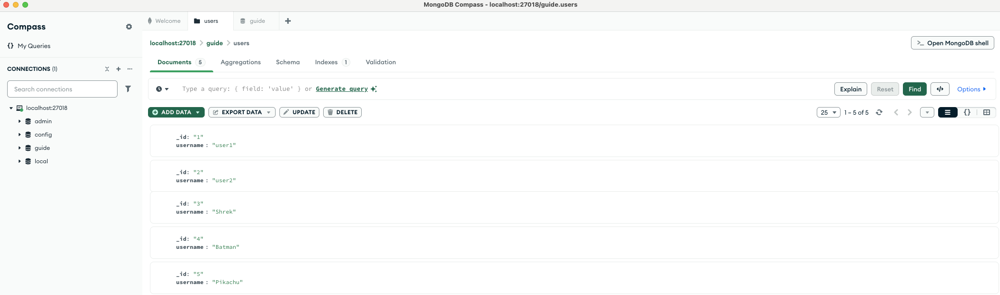
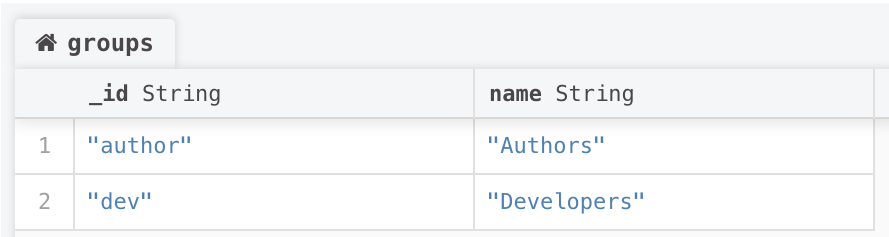
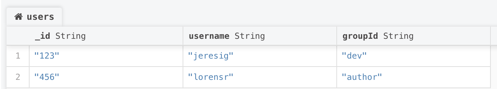
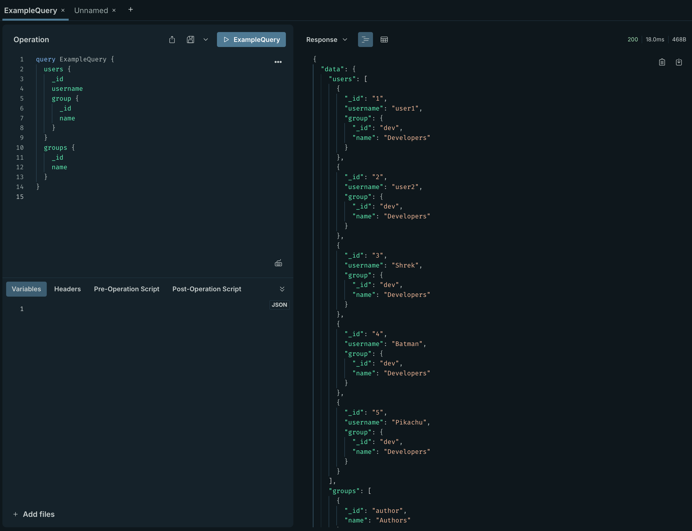

# GraphQL Guide

This repo is for following GraphQL guide book

## Pre-requisites

- **Docker Desktop** installed
- Docker extensions in VS Code to open Development Container
- **Mongodb** Compass (Optional)
- Create database called **guide** in mongodb.
  - Create collection called **Users**
    - Insert JSON data in the collection.

**JSON Data To Insert In Collection Example:**

```json
[
  {
    "_id": "1",
    "username": "user1"
  },
  {
    "_id": "2",
    "username": "user2"
  },
  {
    "_id": "3",
    "username": "Shrek"
  },
  {
    "_id": "4",
    "username": "Batman"
  },
  {
    "_id": "5",
    "username": "Pikachu"
  }
]
```



## Express Server

Open `http://localhost:4000/graphql` 🚀 it will open **Apollo Server**

__Demo:__

https://github.com/user-attachments/assets/c81d0252-119e-40c1-b575-6503be838caa


# Chapter 1 Async Data Loading

1 - Create a new collection called `groups`, like this:



After assign all users to a specific group, by creating a field called `groupId`. 



__In this chapter I switched to Apollo Server__



# Chapter 2 Multiple types of data

```graphql
query ExampleQuery($groupId: String!, $userId: String) {
  users {
    _id
    username
    group {
      _id
      name
    }
  }
  groups {
    _id
    name
  }
  group(id: "author") {
    _id
    name
  }
  user(id: "4") {
    _id
    username
    group {
      name
    }
  }
}
```

Response:
```json
{
  "data": {
    "users": [
      {
        "_id": "1",
        "username": "user1",
        "group": {
          "_id": "dev",
          "name": "Developers"
        }
      },
      {
        "_id": "2",
        "username": "user2",
        "group": {
          "_id": "dev",
          "name": "Developers"
        }
      },
      {
        "_id": "3",
        "username": "Shrek",
        "group": {
          "_id": "dev",
          "name": "Developers"
        }
      },
      {
        "_id": "4",
        "username": "Batman",
        "group": {
          "_id": "dev",
          "name": "Developers"
        }
      },
      {
        "_id": "5",
        "username": "Pikachu",
        "group": {
          "_id": "dev",
          "name": "Developers"
        }
      }
    ],
    "groups": [
      {
        "_id": "author",
        "name": "Authors"
      },
      {
        "_id": "dev",
        "name": "Developers"
      }
    ],
    "group": {
      "_id": "author",
      "name": "Authors"
    },
    "user": {
      "_id": "4",
      "username": "Batman",
      "group": {
        "name": "Developers"
      }
    }
  }
}
```

# Chapter 3: Query Language

- [Operations](#operations)
- [Document](#document)
- [Selection sets](#selection-sets)
- [Fields](#fields)
- [Arguments](#arguments)
- [Variables](#variables)
- [Field aliases](#field-aliases)
- [Fragments](#fragments)
  - [Named Fragments](#named-fragments) 
    - [Type conditions](#type-conditions)
  - [Inline fragments](#inline-fragments)
- [Directives](#directives)
  - [`@skip`](#skip)
  - [`@include`](#include)
  - [`@deprecated`](#deprecated)
- [Mutations](#mutations)
- [Subscriptions](#subscriptions)
- [Summary](#summary) 

## Operations

__Operations__
GraphQL is a specification for communicating with the server. We communicate with it—asking for data and telling it to do things—by sending _[operations](https://spec.graphql.org/draft/#sec-Language.Operations)_. There are three types of operations:
- `query` fetches data
- `mutation` changes and fetches data
- `subscription` tells the server to send data whenever a certain event occurs

__Operations__ can have names, like __AllTheStars__ in this query operation:
```graphql
query AllTheStars {
  githubStars
}
```

## Document

Similar to how we call a `JSON` file or `string` a `JSON` document, a GraphQL file or string is called a GraphQL _[document](https://spec.graphql.org/draft/)_. There are two types of GraphQL documents—executable documents and schema documents. In this chapter, we’ll mainly be discussing executable documents. An executable document is a list of one or more operations or [fragments](#fragments). Here’s a document with a query operation:
```graphql
query {
  githubStars
}
```

Our operation has a single root field, __githubStars__. In this type of document—a single query operation without [variables]() or [directives](#directives)—we can omit query, so the above document is equivalent to:

```graphql
{
  githubStars
}
```

A more complex document could be:

```graphql
query StarsAndChapter {
  githubStars
  chapter(id: 0) {
    title
  }
}

mutation ViewedSectionOne {
  viewedSection(id: "0-1") {
    ...sectionData
  }
}

mutation ViewedSectionTwo {
  viewedSection(id: "0-2") {
    ...sectionData
  }
}

fragment sectionData on Section {
  id
  title
}

subscription StarsSubscription {
  githubStars
}
```

It has all the operation types as well as a fragment. __Note__ that when we have more than one __operation__, we need to give each a name—in this case, __StarsAndChapter__, __ViewedSection__, and __StarsSubscription__.”

## Selection sets

The content between a pair of curly braces is called a [selection set](https://spec.graphql.org/draft/#sec-Selection-Sets)—the list of data fields we’re requesting. For instance, the __StarsAndChapter__ selection set lists the __githubStars__ and __chapter__ fields:

```graphql
{
  githubStars
  chapter(id: 0) {
    title
  }
}
```

And chapter has its own selection set: `{ title }`.

## Fields

A [field](https://spec.graphql.org/draft/) is a piece of information that can be requested in a selection set. In the above query, `githubStars`, `chapter`, and `title` are all fields. The first two are top-level fields (in the outer selection set, at the first level of indentation), and they’re called root query fields. Similarly, viewedSection in the document below is a root mutation field:
```graphql
mutation ViewedSectionTwo {
  viewedSection(id: "0-2") {
    ...sectionData
  }
}
```

## Arguments

On the server, a field is like a function that returns a value. Fields can have _[arguments](https://spec.graphql.org/draft/#sec-Language.Arguments)_: named values that are provided to the field function and change how it behaves. In this example, the `user` field has an `id` argument, and `profilePic` has `width` and `height` arguments:
```graphql
{
  user(id: 1) {
    name
    profilePic(width: 100, height: 50)
  }
}
```

Arguments can appear in any order.

## Variables

We often don’t know argument values until our code is being run—for instance, we won’t always want to query for user #1. The user ID we want will depend on which profile page we’re displaying. While we could edit the document at runtime (like `{ user(id: ' + currentPageUserId + ') { name }}'`), we recommend instead using static strings and _[variables](https://spec.graphql.org/draft/#sec-Language.Variables)_. __Variables__ are declared in the document, and their values are provided separately, like this:
```graphql
query UserName($id: Int!) { 
  user(id: $id) {
    name
  }
}

{
  "id": 2
}
```

After the operation name, we declare `($id: Int!)`: the name of the variable with a `$` and the type of the __variable__. `Int` is an `integer` and `!` means non-null (required). Then, we use the variable name `$id` in an argument in place of the value: `user(id: 2) => user(id: $id)`. Finally, we send a __JSON__ object with variable values along with the query document.
We can also give variables default values, for instance:
```graphql
query UserName($id: Int = 1) { 
  user(id: $id) {
    name
  }
}
```

If `$id` isn’t provided, `1` will be used.

## Field aliases

We can give a field an _[alias](https://spec.graphql.org/draft/#sec-Field-Alias)_ to change its name in the response object. In this query, we want to select `profilePic` twice, so we give the second instance an alias:

```graphql
{
  user(id: 1) {
    id
    name
    profilePic(width: 400)
    thumbnail: profilePic(width: 50)
  }
}
```
The response object is:

```graphql
{
  "user": {
    "id": 1,
    "name": "John Resig",
    "profilePic": "https://cdn.site.io/john-400.jpg",
    "thumbnail": "https://cdn.site.io/john-50.jpg"
  }
}
```

## Fragments

- [Named fragments](#named-fragments)
  - [Type conditions](#type-conditions)
- [Inline fragments](#inline-fragments)

### Named Fragments

_[Fragments](https://spec.graphql.org/draft/)_ group together fields for reuse. Instead of this:

```graphql
{
  user(id: 1) {
    friends {
      id
      name
      profilePic
    }
    mutualFriends {
      id
      name
      profilePic
    }
  }
}
```

we can combine fields with a fragment that we name `userFields`:

```graphql
query {
  user(id: 1) {
    friends {
      ...userFields
    }
    mutualFriends {
      ...userFields
    }
  }
}

fragment userFields on User {
  id
  name
  profilePic
}
```

#### Type conditions

Fragments are defined on a type. The type can be an _[object]()_, _[interface]()_, or _[union]()_. When we’re selecting fields from an interface or union, we can conditionally select certain fields based on which object type the result winds up being. We do this with fragments. For instance, if the `user` field had type `User`, and `User` was an interface implemented by `ActiveUser` and `SuspendedUser`, then our query could be:

```graphql
query {
  user(id: 1) {
    id
    name
    ...activeFields
    ...suspendedFields
  }
}

fragment activeFields on ActiveUser {
  profilePic
  isOnline
}

fragment suspendedFields on SuspendedUser {
  suspensionReason
  reactivateOn
}
```

Then, the server will use the fragment that fits the type returned. If an `ActiveUser` object is returned for user 1, the client will receive the `profilePic` and `isOnline` fields.

### Inline Fragments

[Inline fragments](https://spec.graphql.org/draft/#sec-Inline-Fragments) don’t have a name and are defined inline—inside the selection set, like this:

```graphql
query {
  user(id: 1) {
    id
    name
    ... on ActiveUser {
      profilePic
      isOnline
    }
    ... on SuspendedUser {
      suspensionReason
      reactivateOn
    }
  }
}
```

## Directives

[Directives](https://spec.graphql.org/draft/#sec-Language.Directives) can be added after various parts of a document to change how that part is [validated or executed]() by the server. They begin with an `@` symbol and can have arguments. There are three included directives, `@skip`, `@include`, and `@deprecated`, and servers can define custom directives.

### `@skip`

`@skip(if: Boolean!)` is applied to a field or fragment spread. The server will omit the field/spread from the response when the `if` argument is true.

```graphql
query UserDeets($id: Int!, $textOnly: Boolean!) {
  user(id: $id) {
    id
    name
    profilePic @skip(if: $textOnly)
  }
}
```

```json
{
  "id": 1,
  "textOnly": true
}
```

Sending the above document and variables would result in the below response:
```json
{
  "data":  {
    "user": {
      "id": 1,
      "name": "John Resig"
    }
  }
}
```

While the spec doesn't dictate using JSON to format responses, it is the most common format.

### `@include`

`@include(if: Boolean!)` is the opposite of `@skip`, only including the field/spread in the response when `if` argument is true.

```graphql
query UserDeets($id: Int!, $adminMode: Boolean!) {
  user(id: $id) {
    id
    name
    email @include(if: $adminMode)
    groups @include(if: $adminMode)
  }
}
```

```json
{
  "id": 1,
  "adminMode": false
}
```

Sending the above document and variables would result in the below response:

```graphql
{
  "data":  {
    "user": {
      "id": 1,
      "name": "John Resig"
    }
  }
}
```

### `@deprecated`

Unlike `@skip` and `@include`, which are used in executable documents, [`@deprecated`](https://spec.graphql.org/draft/#sec--deprecated) is used in schema documents. It is placed after a field definition or enum value to communicate that the field/value is deprecated and why—it has an optional `reason` String argument that defaults to “No longer supported.

```graphql
type User {
  id: Int!
  name: String
  fullName: String @deprecated("Use `name` instead")
}
```

## Mutations

[Mutations](https://spec.graphql.org/draft/#sec-Mutation), unlike queries, have side effects—i.e., alter data. The REST equivalent of a query is a `GET` request, whereas the equivalent of a mutation is a `POST`, `PUT`, `DELETE`, or `PATCH`. Often, when the client sends a mutation, it selects the data that will be altered so that it can update the client-side state.

```graphql
mutation {
  upvotePost(id: 1) {
    id
    upvotes
  }
}
```

In this example, the `upvotes` field will change, so the client selects it (i.e., includes it in the selection set).
While not enforced by the specification, the intention and convention is that only root mutation fields like upvotePost alter data—not subfields like `id` or `upvotes`, and not Query or Subscription fields.

We can include multiple root fields in a mutation, but they are executed in series, not in parallel. (All fields in a mutation below the top level and all query fields are executed in parallel.) This way, assuming the code resolving the first root mutation field waits for all of the side effects to complete before returning, we can trust that the second root mutation field is operating on the altered data. If the client wants the root fields to be executed in parallel, they can be sent in separate operations.

While technically “mutation” is an operation type, the root mutation fields are often called “mutations.

## Subscriptions

[Subscriptions](https://spec.graphql.org/draft/#sec-Subscription) are long-lived requests in which the server sends the client data from events as they happen. The manner in which the data is sent is not specified, but the most common implementation is WebSockets, and other implementations include HTTP long polling, server-sent events (supported by all browsers except for IE 11), and webhooks (when the client is another publicly-addressable server).

The client initiates a subscription with:

```graphql
subscription {
  reviewCreated {
    id
    text
    createdAt
    author {
      name
      photo
    }
  }
}
```

As with mutations, we call the subscription operation’s root field the “subscription,” and its selection set is the data that the server sends the client on each event. In this example, the event is the creation of a review. So whenever a new review is created, the server sends the client data like this:
```json
{
  "data": {
    "reviewCreated": {
      "id": 1,
      "text": "Now that’s a downtown job!",
      "createdAt": 1548448555245,
      "author": {
        "name": "Loren",
        "photo": "https://avatars2.githubusercontent.com/u/251288"
      }
    }
  }
}
```

## Summary 

To recap the GraphQL query language, we can send one or more operations in a GraphQL document. Each operation has a (possibly nested) `selection set`, which is a set of `fields`, each of which may have `arguments`. We can also:
- Declare [variables](#variables) after the operation name.
- [Alias](#field-aliases) fields to give them different names in the response object.
- Create [name fragments](#named-fragments) to reuse fields and add [type conditions](#type-conditions) to conditionally select fields from interfaces and unions.
- Add [directives](#directives) to modify how the server handles a part of a document.
- Use [mutations](#mutations) to alter data.
- Use [subscriptions](#subscriptions) to receive events from the server.


